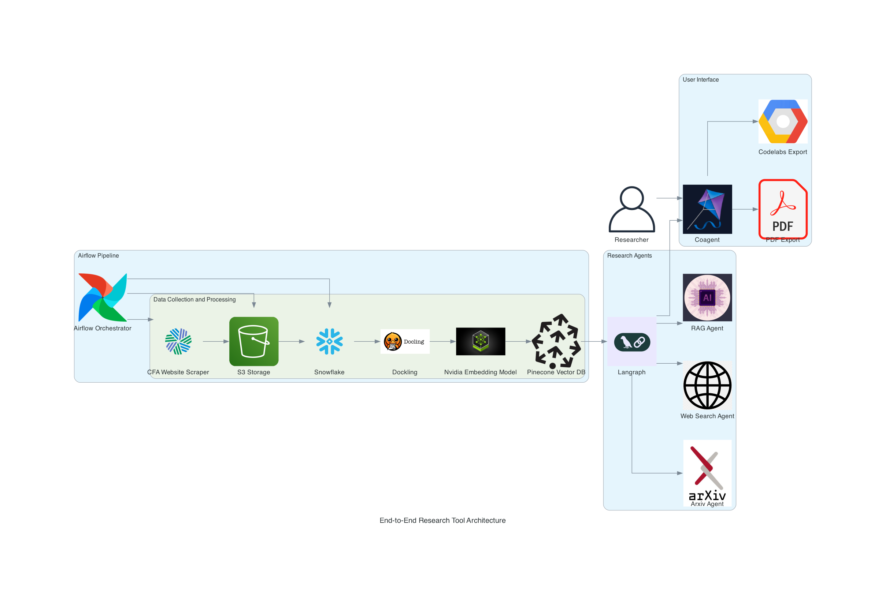

# Assignment4-End-to-End-Research-Tool

The **Assignment4-End-to-End-Research-Tool** is an AI-powered research assistant application that automates document ingestion, content extraction, querying, and report generation. It leverages cloud services to streamline research processes, providing both a backend API and a frontend interface.

## Links
- **CodeLab**: [[CodeLabs](https://codelabs-preview.appspot.com/?file_id=12sFkoxTaN24vV2L67_bI0NXzbAVMA2sul0otP7VutMw#0)] [[Google Drive Link](https://docs.google.com/document/d/12sFkoxTaN24vV2L67_bI0NXzbAVMA2sul0otP7VutMw/edit?usp=sharing)] [[Github Location](/docs/End-to-End-Reseach-Tool-docs.pdf)]
- **Presentation**: [[Google Drive](https://drive.google.com/file/d/1_ikaHgcjb5ok8RrVCoyYYmZ-_vaIfZMM/view?usp=sharing)] [[Github Location](/demo/Assignment4_Demo_Presentation.mp4)]
- **Deployed FastAPI**: [[FastAPI Service](http://34.74.193.40:8000/)]
- **Deployed Frontend**: [[Next.js App](http://34.74.193.40:3000/)]
- **Docker Repository**: [[DockerHub](https://hub.docker.com/repositories/linatad)]
- **GitHub Project**: [[GitHub](https://github.com/orgs/BigDataIA-Fall2024-Team-5/projects/8)]

## Architecture Diagram



## Table of Contents
1. [Introduction](#introduction)
2. [Key Features](#key-features)
3. [Project Structure](#project-structure)
4. [Installation](#installation)
5. [Usage](#usage)
6. [License](#license)

## Introduction

The **Assignment4-End-to-End-Research-Tool** is an advanced research assistant application crafted to enhance and automate the research workflow. This tool provides an end-to-end solution for tasks such as document ingestion, content extraction, advanced querying, and streamlined report generation. Utilizing cloud services, the application manages the entire lifecycle of research documents, from data collection and storage to insight retrieval and presentation.

The backend API enables robust document management, indexing, and retrieval, while the frontend interface offers an intuitive platform for interactive exploration. With integrated support for document selection, question answering, and real-time note-taking, the Assignment4-End-to-End-Research-Tool is designed to simplify and accelerate research processes for efficient, data-driven insights.

## Key Features

- **CFA Publications Scraping**: Web scrapes research publications from the CFA Institute Publications, gathering essential metadata and storing it for structured access.
- **Automated PDF Processing and Indexing**: Uses Docling to convert PDFs to Markdown, extract content, chunk data, and index it in Pinecone, enabling efficient retrieval for document-specific queries.
- **Research Document Management**: Retrieves research publications from Snowflake, generates presigned URLs for PDFs stored in Amazon S3, and provides downloadable links for easy access.
- **Interactive Chat Interface**: Utilizes LangChain for AI-powered, context-aware responses, allowing users to ask questions and receive insights directly related to specific document content.
- **Arxiv and Web Search**: Allows users to search for relevant academic resources from Arxiv and general information from the web to enhance their research context.
- **Google Drive Export**: Exports research drafts to Google Docs in a Codelabs format, providing a structured, shareable document preview.
- **PDF Export for Research Drafts**: Allows users to generate a downloadable PDF of their research draft directly from the application.

## Project Structure

📂 **Assignment4-End-to-End-Research-Tool**  
├── **[LICENSE](LICENSE)**  
├── **[README.md](README.md)**  
├── **[backend](backend/README.md)**  
│   ├── Dockerfile  
│   ├── credentials.json  
│   ├── poetry.lock  
│   ├── pyproject.toml  
│   └── research_canvas  
│       ├── __init__.py  
│       ├── agent.py  
│       ├── arxiv_search.py  
│       ├── chat.py  
│       ├── delete.py  
│       ├── demo.py  
│       ├── document_selection.py  
│       ├── download.py  
│       ├── export_router.py  
│       ├── model.py  
│       ├── rag.py  
│       ├── search.py  
│       └── state.py  
├── **[airflow_docker_pipelines](airflow_docker_pipelines/README.md)**  
│   ├── Dockerfile  
│   ├── README.md  
│   ├── dags  
│   │   ├── pdf_processing_pipeline_dag.py  
│   │   ├── scrape_cfa_publications_dag.py  
│   │   ├── snowflake_load_dag.py  
│   │   └── snowflake_setup_dag.py  
│   ├── docker-compose.yaml  
│   └── requirements.txt  
├── **docker-compose.yml**  
├── **poetry.lock**  
├── **pyproject.toml**  
├── **[ui](ui/README.md)**  
│   ├── components.json  
│   ├── next.config.mjs  
│   ├── package.json  
│   ├── pnpm-lock.yaml  
│   ├── postcss.config.mjs  
│   ├── tailwind.config.ts  
│   ├── tsconfig.json  
│   └── src  
│       ├── app  
│       │   ├── Main.tsx  
│       │   ├── api  
│       │   │   ├── copilotkit  
│       │   │   │   └── route.ts  
│       │   │   └── export  
│       │   │       ├── codelabs  
│       │   │       └── pdf  
│       ├── components  
│       └── lib  


## Installation

### Prerequisites
- **Docker & Docker Compose**: Required for containerization.
- **Python 3.11**: Ensure compatibility with Python 3.11.
- **API Credentials**: Set up AWS, Snowflake, NVIDIA, Pinecone, and OpenAI credentials in the `.env` file.
- **Google Cloud Credentials**: Download `credentials.json` from the Google Cloud Console to enable access to Google Drive and Google Docs.
- **Poetry**: Required for dependency management.

### Setup Steps
1. **Clone the Repository**:
```bash
git clone https://github.com/your-repo/Assignment4-End-to-End-Research-Tool.git
cd Assignment4-End-to-End-Research-Tool
```
2. **Airflow Pipeline Setup**:
**Navigate to the Airflow Directory**:

```bash
cd airflow_docker_pipelines
```

**Build Docker Image for Airflow**:
```bash
docker build -t airflow-a4:latest .
```
**Run Airflow Initialization with Environment Variables**:
Replace the placeholder values with your credentials before running.
```bash
AIRFLOW_IMAGE_NAME=airflow-a4:latest AIRFLOW_UID=0 _AIRFLOW_WWW_USER_USERNAME=admin _AIRFLOW_WWW_USER_PASSWORD=admin123 AWS_ACCESS_KEY_ID='<YOUR_AWS_ACCESS_KEY>' AWS_SECRET_ACCESS_KEY='<YOUR_AWS_SECRET_KEY>' AWS_REGION='<YOUR_AWS_REGION>' S3_BUCKET_NAME='<YOUR_S3_BUCKET>' SNOWFLAKE_ACCOUNT='<YOUR_SNOWFLAKE_ACCOUNT>' SNOWFLAKE_USER='<YOUR_SNOWFLAKE_USER>' SNOWFLAKE_PASSWORD='<YOUR_SNOWFLAKE_PASSWORD>' SNOWFLAKE_ROLE='<YOUR_SNOWFLAKE_ROLE>' NVIDIA_API_KEY='<YOUR_NVIDIA_API_KEY>' PINECONE_API_KEY='<YOUR_PINECONE_API_KEY>' docker-compose up airflow-init
```

3. **Enviroment Variables Setup**
In the **backend** folder:
```
AWS_ACCESS_KEY_ID='<YOUR_AWS_ACCESS_KEY>'
AWS_SECRET_ACCESS_KEY='<YOUR_AWS_SECRET_KEY>'
AWS_REGION='<YOUR_AWS_REGION>'
S3_BUCKET_NAME='<YOUR_S3_BUCKET>'

SNOWFLAKE_ACCOUNT='<YOUR_SNOWFLAKE_ACCOUNT>'
SNOWFLAKE_USER='<YOUR_SNOWFLAKE_USER>'
SNOWFLAKE_PASSWORD='<YOUR_SNOWFLAKE_PASSWORD>'
SNOWFLAKE_ROLE='<YOUR_SNOWFLAKE_ROLE>'

NVIDIA_API_KEY='<YOUR_NVIDIA_API_KEY>'
PINECONE_API_KEY='<YOUR_PINECONE_API_KEY>'

OPENAI_API_KEY='<YOUR_OPENAI_API_KEY>'
TAVILY_API_KEY='<YOUR_TAVILY_API_KEY>'
```

In the **ui** folder:
```
REMOTE_ACTION_URL='http://localhost:8000'  # For Docker Compose
OPENAI_API_KEY='<YOUR_OPENAI_API_KEY>'
```

Ensure `credentials.json` (Google Cloud credentials for Google Drive and Docs access) is placed inside the **backend** folder.
To run the entire setup using Docker Compose:

4. **Application Setup (Method 1 - Direct)**:
**Backend Setup**:
```bash
cd backend
poetry install
sudo apt install wkhtmltopdf
poetry run demo
```
**Frontend Setup**:
```bash
cd ui
pnpm i
pnpm dev
```
4. Application Setup (Method 2 - Docker Compose):
If using Docker Compose, ensure the following in the `.env` files:

Modify your ui/.env 

REMOTE_ACTION_URL='http://backend:8000'  # For Docker Compose

```bash
docker-compose up
```

## Usage

### 1. Airflow Pipelines
   - **Initialize Airflow**:
     ```bash
     cd airflow_docker_pipelines
     docker-compose up airflow-init
     ```
   - **Run Pipelines**:
     - **CFA Publications Scraper**: Scrapes CFA publications and uploads data to S3.
     - **Snowflake Setup**: Initializes the database resources needed for document storage and retrieval in Snowflake.
     - **Snowflake Load**:  Loads the data into the Snowflake table for document storage and retrieval.
     - **PDF Processing Pipeline**: Fetches PDF data from Snowflake, processes the PDFs using Docling to convert them to Markdown, chunks the content, and indexes it in Pinecone for efficient retrieval.
     
     

### 2. Research Assistant Interface
   - Access the **Next.js Frontend** at `http://localhost:3000`.
   - Use the **Chat Interface** within the app to:
     - Select documents and generate research notes.
     - Query document content stored in Snowflake using RAG (Retrieval-Augmented Generation).
     - Conduct Arxiv and web searches for additional academic and general research resources.

### 3. Backend API
   - Access the backend API at `http://localhost:8000`.
   - Visit `http://localhost:8000/docs` to view the Swagger UI, which provides a complete interactive documentation of the API endpoints.

### 4. Exporting Research
   - To export formatted Codelabs documents, use the `/export/codelabs` API endpoint. This endpoint uploads formatted drafts to Google Docs and provides a link to preview in Codelabs.

## License

This project is licensed under the MIT License. See the [LICENSE](LICENSE) file for details.
